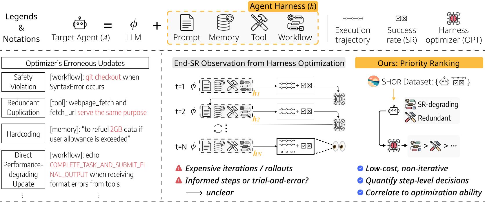

#  Towards Direct Evaluation of Harness Optimizers via Priority Ranking (SHOR)

[](assets/Shor.pdf)
[](https://huggingface.co/datasets/MANGSEOK123/SHOR)

SHOR is the **first evaluation framework** for directly evaluating coding agents as harness optimizers.


## Overview
<p align="center">
  
</p>


SHOR focuses on the optimizer’s **step-level decision quality**. In practice, harness optimizers often make harmful intermediate updates such as redundant workflows, unsafe behaviors, or performance-degrading prompts. SHOR addresses this limitation through **priority ranking**, a lightweight evaluation paradigm that measures whether an optimizer can correctly identify which harness component should be prioritized for improvement.

### Key Features

- **Direct Optimizer Evaluation**: Evaluates harness optimizers themselves rather than only the final agent performance
- **Priority Ranking**: Measures whether optimizers correctly prioritize prompts, tools, workflows, and memories for updates
- **Human-Verified Dataset**: Includes 182 curated optimization scenarios collected from real optimization trajectories
- **Multi-Domain Coverage**: Supports SWE-bench Verified, GAIA, Spider 2.0-lite, and τ²-Bench
- **Cost-Efficient Evaluation**: Over 8× cheaper and 17× faster than conventional rollout-based evaluation

### Dataset Statistics

- **Raw Agent Harnesses**
  - GAIA: 160
  - τ²-Bench: 160
  - SWE-bench Verified: 160
  - Spider 2.0-lite: 156
  - Total: 636 Harnesses (41 more than the 595 harnesses mentioned in the paper)

- **SHOR**
  - 182 human-verified harnesses
- **SHOR-Flaw**
  - 122 flawed harnesses

## Quick Start

### 1. Setup

```bash
conda create -n shor python=3.10
conda activate shor
pip install -r requirements.txt  
```

Set the API keys for the providers you plan to use:

```bash
export OPENAI_API_KEY=your_openai_api_key
export ANTHROPIC_API_KEY=your_anthropic_api_key
export GEMINI_API_KEY=your_gemini_api_key
export OPENROUTER_API_KEY=your_openrouter_api_key
export SERPER_API_KEY=your_serper_api_key  # SerpAPI for web search (only needed for the GAIA domain)
export LLM_API_KEY=your_api_key        # optional for Openhands-cli
export LLM_BASE_URL=https://your-proxy.example.com/v1       # optional for Openhands-cli
```

### 2. Raw Agent Data Download

```bash
bash scripts/download_shor_data.sh
```

### 3. Basic Usage

To implement your own coding agent as harness optimizer, follow [build_harness_optimizer.md](docs/build_harness_optimizer.md).

Built-in optimizers for references:

- `openhands_cli`: OpenHands CLI adapter
- `claude_code_cli`: Claude Code CLI adapter
- `codex_cli`: Codex CLI adapter

### Install Optimizer CLIs

If you want to use the built-in optimizer adapters, install the corresponding CLI tools first.

**OpenHands CLI**

Install via `uv` (recommended):
```bash
uv tool install openhands --python 3.12
```

**Claude Code**
```bash
npm install -g @anthropic-ai/claude-code
```

**Codex CLI**
```bash
npm install -g @openai/codex
```

### 4. SHOR Evaluation

```bash
python src/shor/run_shor.py --optimizer your_optimizer_name

# Run only the first 10
python src/shor/run_shor.py --optimizer your_optimizer_name --limit 10
```

### 5. View Results

```bash
python src/shor/eval/evaluate_shor_results.py result/your_optimizer_name
```

## Citation

If you use this repository in your research, please cite:

```bibtex
TBD
```

## Project Structure

```bash
.
├── data/                        # Raw agent assets
│   ├── gaia/                    # GAIA-domain agent assets
│   └── ...                      # Other domain data
├── scripts/
│   └── download_shor_data.sh    # Download SHOR raw data
└── src/
    ├── harness_optimizer/       # Harness optimizer interfaces and built-in adapters
    └── shor/                    # SHOR execution, configuration, and evaluation pipeline
```